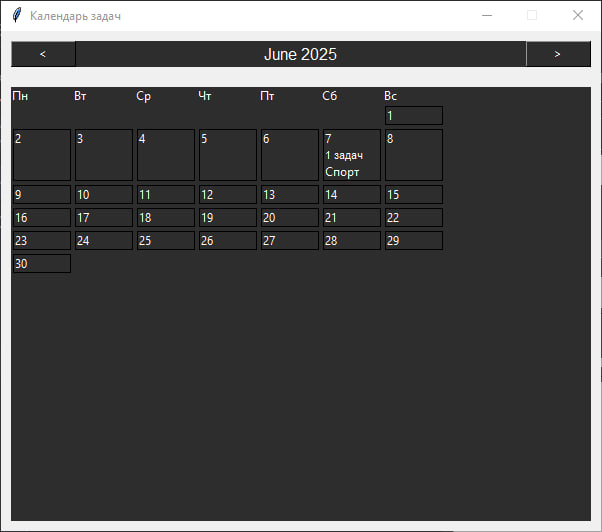

# Tasking
---
### Программа на Tkinter для контроля своих задач.

При запуске программы нас встречает окно Авторизации.

*При регистрации данные сохраняются в json файл*

После входа нас встречает основное окно, в котором есть:
- Смена темы

- Добавление задач

- Просмотр задач

- Календарь задач

